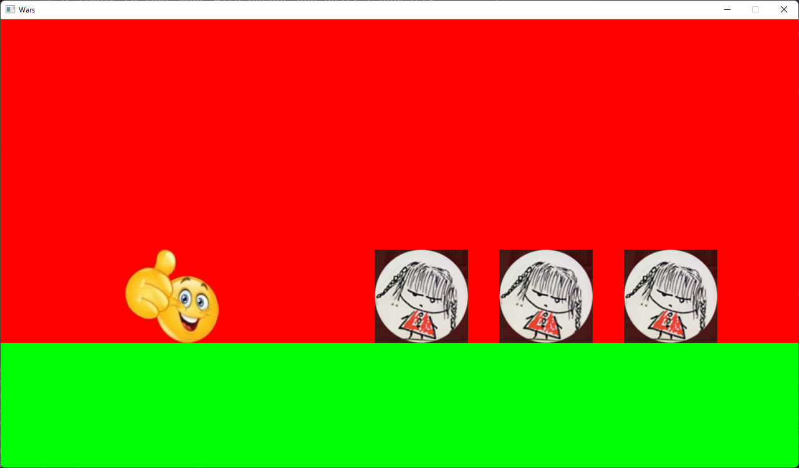

# Wars

A simple 2D game made with raw (-ish) OpenGL and Rust. I honestly don't know why I even made this in the first place, but if you would like to mess around with this game by changing the source code, feel free to do so.

## Gameplay

Basically, use the left and right arrows to move and touch the enemies to kill them. Win by killing all the enemies. There is no "You die" or "You win" screen; if either of those were to happen you'll be taken back to the menu screen.

## Installing

1. Install [Rust](https://www.rust-lang.org/tools/install).
2. Install [LLVM Clang](https://releases.llvm.org/download.html).
3. Clone this repository.
4. Open this repository in a terminal.
5. Run `cargo run --release`

## Code Structure

Since this is the main page README I don't have time nor space to go over every last detail of the game's code but here's a basic overview.

- `main.rs` contains the entry point, which is not much. It's basically just a main function that creates a `Game` instance and runs it.
- `lib.rs` contains the core component's the game's engine, including the `Game` encapsulation itself, the windowing system, and the scene management system.
- `graphics.rs` contains the rendering backend for the game. It is probably the longest file in the entire codebase and contains a lot of unsafe codeblocks, which is enough to make some people uncomfortable.
- `scenes.rs` is where most of the game's behaviour and layout resides. Basically, in Wars, the different screens, menus, and levels are organized into what is known as *scenes*. The `scenes.rs` file contains all the scenes in the game, plus their behaviours. This is usually the file that people (like [carpetmaker3162](https://github.com/carpetmaker3162)) edits to alter the gameplay.
- To switch from one scene to another, simply return a `Some` of a `Box` of the scene that you would like to switch to.
- `physics.rs` is supposed to contain physics-related stuff but right now it only contains a collision-detection system (which is also happens to be not tested at all). The entire module is currently unused and the only reason it's there is for modders to use.

## Conclusion

This might not be the best game in the world, but if you want to mess around with other people's code, feel free to use this game.